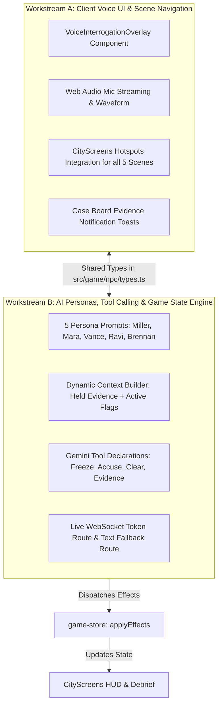

# Act 2: Full Voice-Driven Detective Investigation (5 AI NPCs)

Replace all static multiple-choice dialogue with **free-form AI voice conversations** across all 5 scenes in "The Ten-Minute Window". The player speaks freely into their microphone as Detective Miller's partner; each NPC listens, responds in character via real-time audio, and dynamically triggers game state mutations (evidence unlocks, emergency freeze, false lead penalties, and case resolution).

---

## The 5-Scene Blueprint

| Scene | Location | AI NPC Persona | Player Objective | Dynamic Game Action / Tool |
|---|---|---|---|---|
| **Scene 1** | Detective Office | **Detective Miller** (Gruff, senior partner) | Ask free questions about the case, caller ID, and leads before leaving | Briefing complete; timer starts counting down from `10:00` |
| **Scene 2** | Victim's Flat | **Mara Okoye** (Panicked, emotional victim) | Comfort Mara, elicit details of spoofed call & OTP, discover repair shop & delivery card | Reveals `otp-message` & `call-log`; unlocks leads to Repair Shop & Bank |
| **Scene 3** | Bank Branch | **Teller Vance** (Formal, adversarial compliance banker) | Verbally articulate timestamps and fraud proof to convince him to override policy | Tool: `authorize_freeze()` -> Sets `branch.freeze-authorized` |
| **Scene 4** | Repair Shop | **Ravi Sunder** (Casual, defensive technician — Red Herring) | Interrogate about phone screen repair; avoid falsely accusing him | If accused -> `case.accused-repair-shop` (-score); If cleared -> `deduction.repair-shop-cleared` |
| **Scene 5** | Police Station | **Sgt. Brennan** (Bureaucratic, thorough police desk) | Verbally summarize the full scam chain from spoofed call to bank freeze | Tool: `lodge_police_report()` -> Triggers Act 3 Debrief & `funds-recovered` |

---

## Parallel Workstreams for Two Agents

---

## Workstream 1: Frontend Client, Voice UI & Scene Integration (Agent Alpha)

### Files & Components:
1. **[NEW] `src/game/npc/types.ts`**:
   - Contract defining `NpcId`: `"miller" | "mara" | "vance" | "ravi" | "brennan"`.
   - Tool calling signatures: `authorize_freeze`, `accuse_suspect`, `clear_lead`, `give_evidence`, `lodge_report`.
2. **[NEW] `src/game/npc/VoiceInterrogationOverlay.tsx`**:
   - Noir visual novel presentation sliding up from the bottom of the screen.
   - Character portrait, name, mood indicator.
   - Audio waveform visualizer (pulse animation matching speech volume).
   - Push-to-talk mic button + open mic toggle + text input bar for no-mic testing.
   - Real-time streaming subtitle reel.
3. **[NEW] `src/game/npc/useNpcVoice.ts`**:
   - Connects browser mic (`AudioWorklet` / 16kHz PCM) to Gemini Live WebSocket via ephemeral token.
   - Schedules PCM audio playback (`PcmPlayer`) for instant NPC voice response.
   - Listens for tool calls emitted by the AI and translates them into `applyEffects(...)`.
4. **[MODIFY] `src/game/integration/CityScreens.tsx`**:
   - Wire `handlers.talk(npc)` across all 5 scenes to trigger `VoiceInterrogationOverlay`.
   - Keep the 10-minute timer synchronized with active conversations.
   - Launch `Debrief.tsx` automatically when Sgt. Brennan lodges the formal report.

---

## Workstream 2: AI Personas, Context Engine & Tool Execution (Agent Beta)

### Files & Engine:
1. **[NEW] `src/game/npc/personas/`**:
   - **`miller.ts`**: Case briefing persona. Instructs detective on the 10-minute window, caller Martin Hayes, and two leads (repair shop, delivery card).
   - **`mara.ts`**: Emotionally distressed victim. Reveals OTP code and caller details when treated with empathy; mentions Ravi and missed delivery package.
   - **`vance.ts`**: Adversarial compliance teller. Rejects requests until player verbally explains that the OTP timestamp matches the spoofed call within the 10-minute clearing queue.
   - **`ravi.ts`**: Red herring repairman. Emphasizes he only replaced the screen; flags the detective as mistaken if they accuse him of SIM cloning.
   - **`brennan.ts`**: Police resolution desk. Listens to the detective's verbal case summary and validates the full chain before lodging the statutory report.
2. **[NEW] `src/game/npc/context-builder.ts`**:
   - Injects the detective's current case dossier (held evidence, unlocked deductions, elapsed timer time) into each NPC's system prompt before connection.
3. **[NEW] `src/app/api/detective/npc-token/route.ts`**:
   - Issues ephemeral tokens with `@google/genai` Live constraints:
     - Voice configurations tailored per NPC (gruff male voice for Miller, trembling female voice for Mara, formal male voice for Vance, casual voice for Ravi, steady officer voice for Brennan).
     - Function declarations for `authorize_freeze`, `give_evidence`, `accuse_suspect`, `clear_lead`, `lodge_report`.
4. **[NEW] `src/app/api/detective/npc-chat/route.ts`**:
   - Fast REST endpoint using `gemini-2.5-flash` with function calling for typed chat and offline testing.

---

## Verification & Playthrough Test Plan

### Automated Tests:
- `pnpm test src/game/npc` — verifies persona prompt construction, tool schemas, and game effect dispatchers.
- `pnpm test src/game/integration` — verifies full playthrough from Office -> Flat -> Bank -> Repair Shop -> Police Station -> Debrief.

### End-to-End Voice Playthrough:
1. **Office**: Speak to Miller: *"What's the victim's name and how much was stolen?"* -> Miller responds with Mara Okoye and £4,850.
2. **Flat**: Click Bank Statement and Phone hotspots -> Collect evidence. Speak to Mara: *"Tell me about the call from Martin Hayes"* -> Mara explains the OTP panic and reveals the text.
3. **Bank**: Speak to Vance: *"The OTP was stolen under a spoofed call 6 minutes ago, check batch 4471!"* -> Vance calls `authorize_freeze()` -> Freeze notification appears on screen.
4. **Repair Shop**: Speak to Ravi: *"Did you touch her SIM card?"* -> Ravi defends himself -> Player moves on without accusing him.
5. **Police Station**: Speak to Brennan: Summarize the case -> Brennan calls `lodge_police_report()`.
6. **Debrief**: Scorecard displays **Grade A — Master Detective (Funds Recovered, 5/5 Evidence, 2/2 False Leads Dismissed)**.
